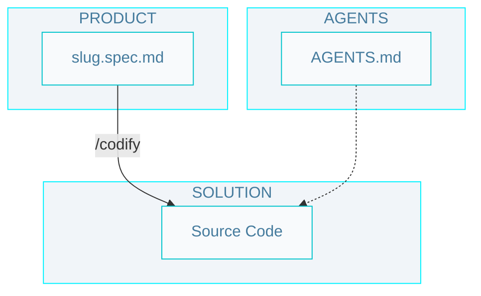

# Level 1 SDD workflow

## Commands

- `/codify` - Run the implementation cycle for one specification: generate plans, produce code, and validate with tests.

## Artifacts

- `spec-slug.spec` - A detailed specification (problem, solution, verification) of a feature or technical requirement.

- `Source Code` - The implementation of the system, including unit tests.
